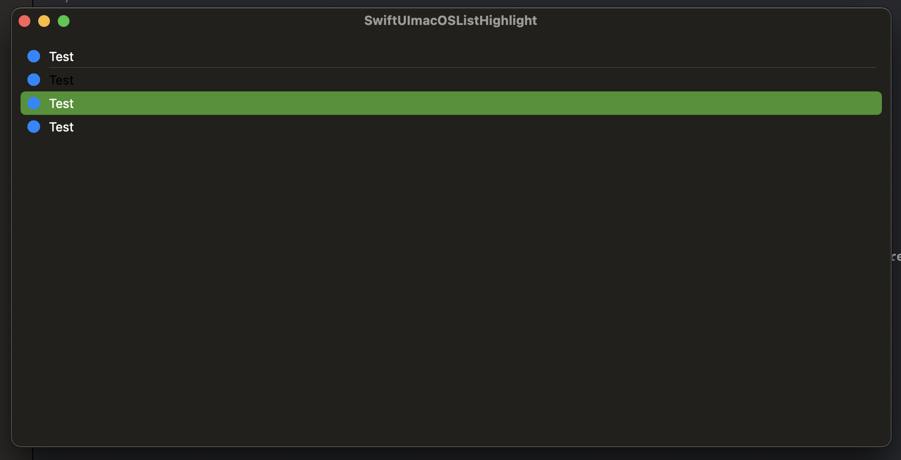

#  FB13310835 - SwiftUI macOS: Highlighted row in a list should be available.

## Response from Apple

The environment value backgroundProminence (https://developer.apple.com/documentation/swiftui/environmentvalues/backgroundprominence) should be used to change color accordingly instead of relying on the selection value. 

Provided example is in ContentReviewResponse.swift

## Scenario

There is a selectable list, which has some design adjustments based on the selected state.
MacOS adds a colored background to the highlighted row.

## The Issue

The selection is only applied on mouse up, but the row is already highlighted on mouse down.
It is not possible to detect wheather the row is highlighted or not.

## Suggestion

Add a highlighted binding just like the selected binding.

## Example Code

The example contains selectable List. When clicking on a list item, it is highlighted (colored background) before it gets selected (adjusted font color). 

## Tested on 

- macOS  14.0
